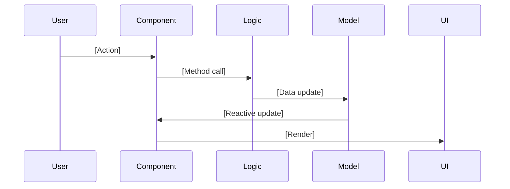

<!-- ========================================================================= -->
<!-- ✏️ USER INPUT SECTION - Please fill in the information below             -->
<!-- ========================================================================= -->

## 🐛 Bug Information

**Business Type**:
<!-- e.g., HS, SK, NV, ZL -->

**Bug Steps Description with Evidence**:
<!--
Describe the bug and steps to reproduce:
1. What is the bug/issue you encountered?
2. Step 1 to reproduce
3. Step 2 to reproduce
4. Step 3 to reproduce (add more if needed)
5. Upload screenshots, error logs, console errors, or video recordings
-->

**Actual Behavior**:
<!-- What actually happens - the bug behavior -->

**Expected Behavior**:
<!-- What should happen - expected behavior -->

<!-- Optional: Expand this section if you need to provide additional environment details -->

📱 Environment Details (Optional - Click to expand if needed)

- **Service Type**: TO / DT / EI
- **Device**: Android Tablet / WPF / Browser (dev mode)
- **Screen Resolution**: HS-SO 1680x1050 / SK-L 1920x1200 / SK-P 1080x1920 / ZL 945x1680 / NV 945x1680 / LO 1920x158 / Other: _____
- **OS Version**:
- **App Version**:

---

<!-- ========================================================================= -->
<!-- 🤖 COPILOT INSTRUCTIONS BELOW - DO NOT MODIFY                             -->
<!-- The sections below are for GitHub Copilot to guide investigation & fix   -->
<!-- ========================================================================= -->

---

# 📚 PHASE 1: INVESTIGATION - Required Reading

**CRITICAL**: Before investigating, read these instruction files to understand the system architecture:

<strong>🏗️ Core Architecture (READ FIRST)</strong>

1. `htmlV3/SO/.github/copilot-instructions.md` - Project structure & business types
2. `htmlV3/SO/.github/language-policy.md` - Multilingual prompt/response policy (VN/JP/EN)
3. `htmlV3/SO/.github/instructions/coding-convention.instructions.md` - Coding standards
4. `htmlV3/SO/.github/instructions/ui-generation.instructions.md` - UI patterns & Vue 3

<strong>🔄 Order Flow Instructions (Read based on Business Type)</strong>

### HS Business Type (WebSocket-based)
4. `htmlV3/SO/.github/instructions/zgso-order-flow-hs.instructions.md` - Core order flow
5. `htmlV3/SO/.github/instructions/zgso-startup-hs.instructions.md` - Startup & WebSocket
6. `htmlV3/SO/.github/instructions/zgso-table-status-hs.instructions.md` - Table status
7. `htmlV3/SO/.github/instructions/zgso-menu-progress-hs.instructions.md` - Menu progress
8. `htmlV3/SO/.github/instructions/zgso-menu-stock-hs.instructions.md` - Menu stock
9. `htmlV3/SO/.github/instructions/zgso-order-arrived-hs.instructions.md` - Order arrived
10. `htmlV3/SO/.github/instructions/zgso-order-history-hs.instructions.md` - Order history
11. `htmlV3/SO/.github/instructions/zgso-order-stop-hs.instructions.md` - Order stop
12. `htmlV3/SO/.github/instructions/zgso-payment-flow-hs.instructions.md` - Payment flow
13. `htmlV3/SO/.github/instructions/zgso-crew-mode-hs.instructions.md` - CrewMode
14. `htmlV3/SO/.github/instructions/zgso-call-staff-hs.instructions.md` - Call staff
15. `htmlV3/SO/.github/instructions/zgso-settings-sync-hs.instructions.md` - Settings sync
16. `htmlV3/SO/.github/instructions/zgso-settings-request-lo.instructions.md` - LO settings
17. `htmlV3/SO/.github/instructions/zgso-order-flow-lo.instructions.md` - LO order flow

### SK/NV/ZL Business Types (C# Bridge-based)
18. `htmlV3/SO/.github/instructions/zso-order-flow.instructions.md` - ZSO order flow

<strong>🔧 Technical References</strong>

- `src/logic/common/WebSocketTypes.ts` - WebSocket interfaces & types
- `src/model/` - Data models (ZgsoOrder, Order, DataPool, etc.)

---

# 🔍 PHASE 1 TASKS: Investigation Checklist

<strong>Investigation Steps</strong>

1. **Reproduce Bug** → Set up environment, reproduce steps, capture evidence
2. **Identify Components** → List Vue components, logic classes, data models, WebSocket/Bridge calls
3. **Trace Code Flow** → Map user action → handler → logic → data → UI render
4. **Analyze Root Cause** → Pinpoint exact failure point, understand why, check edge cases
5. **Document Findings** → Complete sections below

## 📝 Investigation Results
**Root Cause Analysis:**
<!-- Write detailed analysis here -->

**Affected Files:**
-
-

**Sequence Diagram (if complex):**

**Why it fails:**
<!-- Explain the root cause -->

**Impact Assessment:**
- [ ] Critical (blocks core functionality)
- [ ] High (major feature broken)
- [ ] Medium (feature degraded)
- [ ] Low (cosmetic or minor)

---

# 🔧 PHASE 2: FIX IMPLEMENTATION

## Fix Strategy
<!-- Describe how you plan to fix the bug -->

## Code Changes Required

### Files to Modify
1. **File**: `_____`
   - **Change**:
   - **Reason**:

2. **File**: `_____`
   - **Change**:
   - **Reason**:

<strong>Fix Principles (MUST FOLLOW)</strong>

### ✅ Must Do
- Maintain Vue 3 Composition API pattern
- Keep logic separated in `src/logic/`
- Follow business type separation (HS/SK/NV/ZL)
- Use proper TypeScript types & error handling
- Maintain WebSocket sync (HS) or C# bridge (SK/NV/ZL)

### ❌ Never Do
- NO Options API
- NO breaking changes to existing APIs
- NO mixing HS and SK/NV/ZL logic

<strong>Testing Requirements</strong>

### Regression Test (REQUIRED)
- [ ] Add test to CSV: `tests/test-data/[BT]-[feature]-testcases.csv` (Format: `[BT][Feature]E[XX]`)
- [ ] Add Playwright test: `tests/[BT]/specs/[feature].spec.ts`

### Manual Testing
- [ ] Test on actual device (all applicable BT/ST combinations)
- [ ] Test edge cases & verify no console errors
- [ ] Cross-device sync (if HS: SO + LO)

<strong>Implementation Checklist</strong>

- [ ] Code fix following standards (Vue 3, TypeScript, logic separation)
- [ ] No breaking changes, no TypeScript/console errors
- [ ] Event handlers cleaned up (no memory leaks)
- [ ] Regression test added
- [ ] Manual testing completed
- [ ] Self-review & documentation updated

## 🔗 Related Issues
<!-- Link to related issues or PRs -->

## 📎 Additional Context
<!-- Add debugging notes, alternative solutions considered, etc. -->

---

**@github/copilot**:

**PHASE 1 - Investigation**: Please read ALL instruction files listed above to understand the full system architecture before analyzing the root cause. Focus on:
1. Understanding the order flow (HS vs SK/NV/ZL)
2. Tracing WebSocket events (HS) or C# bridge calls (SK/NV/ZL)
3. Checking state management and reactive updates
4. Identifying async/await issues
5. Reviewing lifecycle hooks and event listeners

**PHASE 2 - Fix**: After root cause is identified, implement fix following:
- `htmlV3/SO/.github/instructions/coding-convention.instructions.md`
- `htmlV3/SO/.github/instructions/ui-generation.instructions.md`
- Relevant feature-specific instruction file
- Add regression test to prevent recurrence
